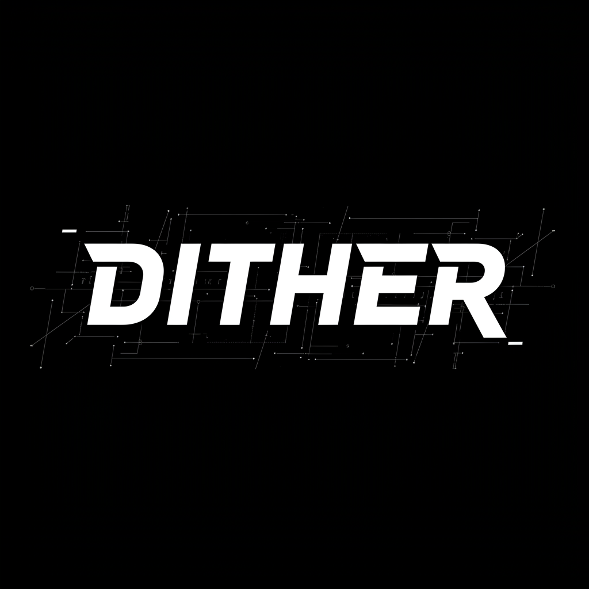

# Dither

<div align="center">
  
  <h3>A modern web-based image dithering tool</h3>
  <p>Apply various dithering techniques to your images directly in the browser with real-time preview</p>
</div>

<div align="center">
  <a href="https://github.com/Saganaki22/Dither/blob/main/LICENSE">
    
  </a>
  
  
  
  
  
</div>

## Features

- 8 different dithering algorithms: Bayer, Floyd-Steinberg, Atkinson, Stucki, Burkes, Random, Halftone, and Blue Noise
- Customizable settings for each algorithm
- Real-time preview with zoom and pan functionality
- Monochrome or color dithering with adjustable color depth
- Download in PNG, JPEG, or WebP formats
- Completely client-side processing (no server uploads)
- Responsive design for desktop and mobile
- Educational about page explaining dithering concepts and applications

## About

Dither includes an educational section that explains:
- What dithering is and its historical significance
- Common applications of dithering in various fields
- Detailed explanations of each dithering algorithm
- Visual examples and comparisons of different dithering techniques
- Best practices and use cases for different dithering methods



## Demo

Visit the live demo at [https://dither-drbaph.vercel.app](https://dither-drbaph.vercel.app)

## Development

### Prerequisites

- Node.js 18.x or higher
- pnpm (recommended) or npm

### Installation

1. Clone the repository:
   ```bash
   git clone https://github.com/Saganaki22/Dither.git
   cd dither
   ```

2. Install dependencies:
   ```bash
   pnpm install
   ```

3. Start the development server:
   ```bash
   pnpm dev
   ```

4. Open [http://localhost:3000](http://localhost:3000) in your browser.

### Available Scripts

- `pnpm dev` - Start the development server
- `pnpm build` - Build the production application
- `pnpm start` - Start the production server
- `pnpm lint` - Run ESLint for code linting

## Tech Stack

- **Framework**: Next.js 15
- **Language**: TypeScript
- **Styling**: Tailwind CSS
- **UI Components**: Radix UI
- **State Management**: Zustand
- **Form Handling**: React Hook Form
- **Validation**: Zod
- **Animations**: Tailwind CSS Animate

## Contributing

Contributions are welcome! Please feel free to submit a Pull Request.

## License

This project is licensed under the Apache License 2.0 - see the LICENSE file for details.

